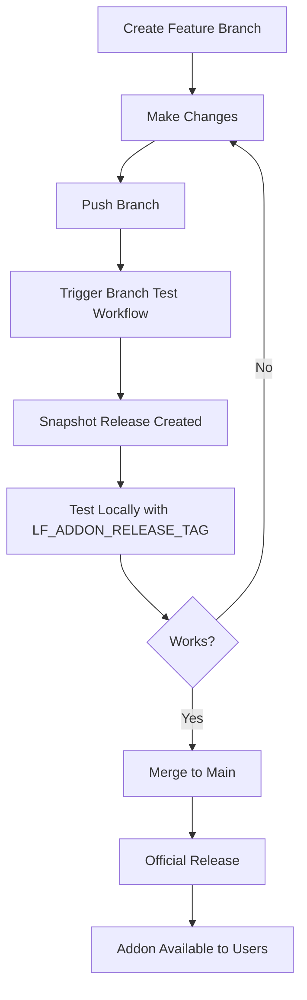

# Addon Development Workflow

Quick reference for developing and testing addons.

## Development Flow



## Quick Commands

### Test from Feature Branch

```bash
# 1. Create and push your changes
git checkout -b feat-my-addon-changes
# ... make changes ...
git push origin feat-my-addon-changes

# 2. Trigger test build
gh workflow run test-addon-branch.yml \
  -f branch=feat-my-addon-changes \
  -f addon=stt \
  -f platform=macos-arm64 \
  -f create_release=true

# 3. Wait for completion, then test
export LF_ADDON_RELEASE_TAG=v-snapshot-feat-my-addon-changes-TIMESTAMP
lf addons install stt
```

### Test from Main (Pre-Release)

```bash
# Create a numbered snapshot
gh workflow run snapshot-release.yml \
  -f snapshot_version=0.0.27-snapshot.1 \
  -f build_addons=true \
  -f draft=true

# Test
export LF_ADDON_RELEASE_TAG=v0.0.27-snapshot.1
lf addons install stt
```

### Build Only (No Release)

```bash
# Just build wheels for testing
gh workflow run build-addon-wheels.yml \
  -f addon=stt \
  -f platform=macos-arm64 \
  -f branch=feat-my-addon-changes

# Download artifacts
gh run download <run-id>
```

## File Checklist

When adding/modifying an addon, update the registry YAML file:

- [ ] **`addons/registry/<addon-name>.yaml`** - Single source of truth for addon metadata

The YAML files are automatically loaded by both Go (CLI) and Python (server), so you only need to update one file!

## Common Scenarios

### Scenario 1: Adding a New Package to Existing Addon

```bash
# Branch: feat-add-package-to-stt
# Files: addons/registry/stt.yaml (add package to packages list)

# Test
gh workflow run test-addon-branch.yml \
  -f branch=feat-add-package-to-stt \
  -f addon=stt \
  -f platform=macos-arm64 \
  -f create_release=true
```

### Scenario 2: Creating a New Addon

```bash
# Branch: feat-add-embeddings-addon
# Files: Create addons/registry/embeddings.yaml with addon metadata

# Test
gh workflow run test-addon-branch.yml \
  -f branch=feat-add-embeddings-addon \
  -f addon=all \
  -f platform=all \
  -f create_release=true
```

### Scenario 3: Testing Package Version Changes

```bash
# Branch: fix-faster-whisper-version
# Quick iteration: build locally

python tools/build_addon_wheels.py \
  --addon stt \
  --platform macos-arm64 \
  --output dist/addons

# Manual install
tar -xzf dist/addons/stt-wheels-macos-arm64.tar.gz \
  -C ~/.llamafarm/addons/stt/
```

### Scenario 4: Multi-Platform Testing Before Release

```bash
# Use snapshot workflow with all platforms
gh workflow run snapshot-release.yml \
  -f snapshot_version=0.0.27-rc.1 \
  -f build_addons=true \
  -f draft=false  # Make it visible but marked as pre-release

# Test on different machines
export LF_ADDON_RELEASE_TAG=v0.0.27-rc.1
lf addons install stt
```

## Cleanup

### Remove Branch Snapshots

```bash
# List snapshot releases
gh release list --limit 20

# Delete a snapshot
gh release delete v-snapshot-feat-my-changes-TIMESTAMP --yes
git push origin :refs/tags/v-snapshot-feat-my-changes-TIMESTAMP
```

### Bulk Cleanup

```bash
# Delete all snapshot releases older than 7 days
gh release list --json tagName,createdAt,isDraft \
  --jq '.[] | select(.isDraft and .tagName | startswith("v-snapshot")) | .tagName' | \
  xargs -I {} gh release delete {} --yes
```

## Environment Variables

| Variable | Purpose | Example |
|----------|---------|---------|
| `LF_ADDON_RELEASE_TAG` | Override release to download from | `v-snapshot-feat-123-20260202` |
| `LF_DATA_DIR` | Override data directory | `~/.llamafarm-test` |
| `LF_BIN_DIR` | Override binary directory | `~/custom-bin` |

## Troubleshooting

### Build Fails: "No binary wheels available"

A package doesn't have pre-built wheels. Check with:
```bash
pip download --only-binary=:all: package-name
```

Solution: Remove from ADDON_SPECS or build wheels manually.

### Download Fails: 404

Release or asset doesn't exist. Verify:
```bash
gh release view $LF_ADDON_RELEASE_TAG
gh release view $LF_ADDON_RELEASE_TAG --json assets
```

### Addon Not Loaded

Check PYTHONPATH injection in logs:
```bash
tail -f ~/.llamafarm/logs/universal-runtime.log | grep -i python
```

Verify state file:
```bash
cat ~/.llamafarm/addons.json | jq .
```
