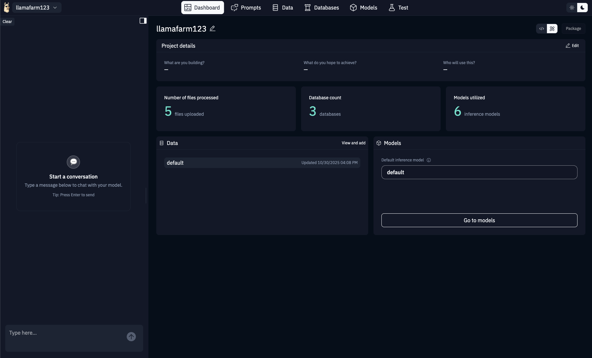
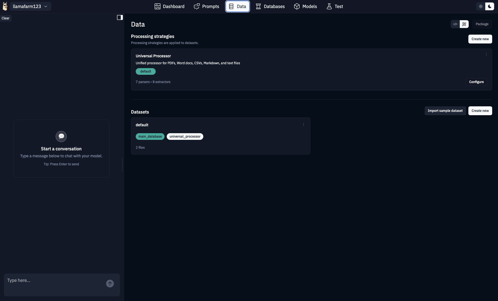
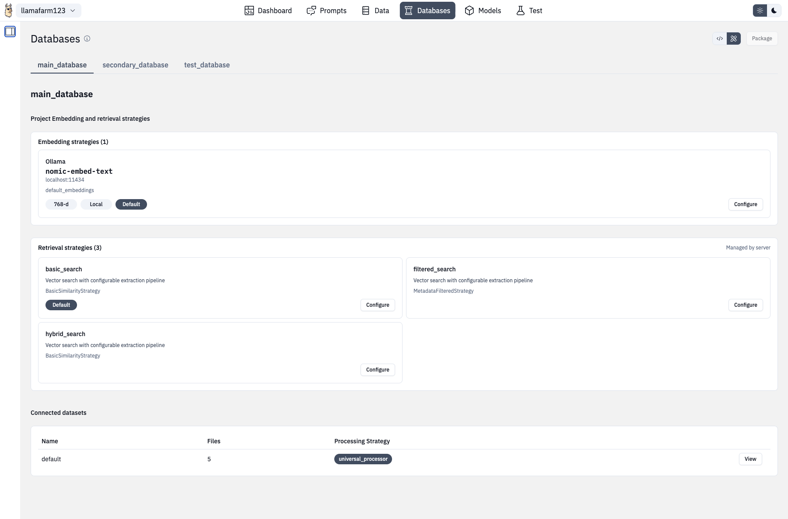

# Designer Features

This guide walks through each section of the Designer web UI, explaining what you can do and how to use the various features.

## Projects

The Projects section is your starting point in the Designer. From the home page, you can:

### Creating a New Project

1. Click the "Create new project" button on the home page
2. Enter a project name (alphanumeric and hyphens only)
3. Optionally fill in the project brief:
   - **What**: Describe what your project does
   - **Goals**: Define what you want to achieve
   - **Audience**: Specify who will use it
4. Click "Create" to initialize the project

The Designer will automatically create a `llamafarm.yaml` configuration file with sensible defaults.

### Switching Projects

Click on any project card on the home page to switch to that project. Your current project is highlighted in the header.

### Editing Project Details

From any project page, click the project name dropdown in the header and select "Edit project" to update the project brief or rename the project.

## Dashboard

The Dashboard provides an at-a-glance view of your active project.

*The Dashboard showing project overview and key metrics*

### What You'll See

- **Project Configuration Summary**: Key settings like runtime provider, model, and enabled features
- **Dataset Statistics**: Number of datasets, total files, and processing status
- **Quick Actions**: Common tasks like creating datasets or editing prompts
- **Recent Activity**: Latest changes to your project configuration

### Using the Dashboard

The Dashboard is read-only and designed for quick reference. Use the action buttons to jump directly to relevant sections when you need to make changes.

## Data Management

The Data section is where you manage datasets and configure how files are processed.

*Managing datasets and processing strategies*

### Processing Strategies

Processing strategies define how your data is parsed, chunked, and embedded. You can:

- **View existing strategies**: See all configured data processing strategies for your project
- **Create new strategies**: Click "Create new" to define a strategy from scratch
- **Copy strategies**: Duplicate an existing strategy as a starting point
- **Edit strategies**: Click on any strategy card to view and modify its configuration

Each strategy includes:
- **Parsers**: How to extract text from different file types (PDF, DOCX, TXT, CSV, Markdown)
- **Chunking**: How to split documents into manageable pieces
- **Embedding**: Which model to use for creating vector embeddings
- **Storage**: Which vector database to use

### Datasets

Below the processing strategies, you'll see your datasets:

- **Create Dataset**: Click "+ Create dataset" to add a new dataset
  - Choose a name
  - Select a processing strategy
  - Select a database
- **Upload Files**: Drag and drop files onto a dataset card or click to browse
- **Process Dataset**: After uploading, click "Process" to start ingestion
- **View Details**: Click a dataset name to see files, metadata, and processing status
- **Delete Dataset**: Use the dropdown menu on each card

### Supported File Types

The Designer supports uploading and processing:
- PDF documents (`.pdf`)
- Word documents (`.docx`)
- Text files (`.txt`)
- CSV files (`.csv`)
- Markdown files (`.md`, `.markdown`)

### Config Editor Mode

Toggle to Config Editor mode to see the raw YAML configuration for datasets and strategies. This is useful for:
- Copying configuration between projects
- Making bulk changes
- Understanding the underlying structure

## Models

The Models section lets you configure which AI models your project uses.

### Runtime Configuration

Select your runtime provider:
- **Ollama** (default): Local models on your machine
- **OpenAI**: GPT models via API
- **OpenAI-compatible**: Custom endpoints (vLLM, LM Studio, etc.)

### Model Selection

Depending on your provider:
- **Ollama**: Choose from downloaded models or pull new ones
- **OpenAI**: Enter your API key and select a model
- **Custom**: Configure the base URL and model name

### Model Parameters

Adjust runtime behavior:
- **Temperature**: Control randomness (0.0 = deterministic, 1.0+ = creative)
- **Max Tokens**: Limit response length
- **Top P**: Nucleus sampling threshold
- **Frequency Penalty**: Discourage repetition
- **Presence Penalty**: Encourage topic diversity

### Testing Connections

Use the "Test Connection" button to verify your model configuration works before saving.

## Databases (RAG Configuration)

The Databases section is where you configure Retrieval-Augmented Generation.

*Configuring vector databases and retrieval strategies*

### Vector Databases

Create and manage vector databases:
- **ChromaDB** (default): Local vector storage
- **Pinecone**, **Weaviate**, etc.: Cloud-hosted options

Each database needs:
- A unique name
- Storage configuration (connection details for hosted options)

### Embedding Strategies

Configure how text is converted to vectors:
- **Embedding Model**: Choose from available models (e.g., `nomic-embed-text`)
- **Chunk Size**: How large each embedded piece should be
- **Overlap**: How much chunks should overlap to preserve context

### Retrieval Methods

Define how relevant documents are found:
- **Similarity Search**: Pure vector similarity (default)
- **Hybrid Search**: Combines vector and keyword matching
- **MMR (Maximal Marginal Relevance)**: Balances relevance with diversity
- **Metadata Filtering**: Add filters based on document properties

### Testing Queries

Use the built-in query tester to:
1. Enter a test question
2. See which documents are retrieved
3. Verify relevance and ranking
4. Adjust retrieval parameters if needed

## Prompts

The Prompts section helps you design and test system prompts.

### Creating Prompts

1. Click "Add Prompt" to create a new prompt template
2. Give it a descriptive name
3. Write your system prompt (supports variables like `{context}`, `{question}`)
4. Add any user message templates

### Prompt Sets

Organize related prompts into sets:
- Default prompts that always run
- Conditional prompts based on context
- Specialized prompts for different tasks

### Testing Prompts

Use the test panel to:
- Enter sample inputs
- See the rendered prompt (with variables filled in)
- Get actual model responses
- Compare multiple prompt versions side-by-side

### Prompt Library

Browse example prompts for common use cases:
- RAG-enhanced Q&A
- Document summarization
- Code generation
- Data extraction

## Chat Interface

The Chat section provides an interactive way to test your AI project.

### Starting a Chat

Simply type a message and press Enter or click Send. The chat uses:
- Your configured runtime and model
- Active system prompts
- RAG context if enabled

### RAG Toggle

Use the RAG toggle to:
- **On**: Retrieve relevant documents before answering (default for RAG projects)
- **Off**: Use only the model's training data

When RAG is on, you'll see retrieved document snippets alongside responses.

### Session Management

Each project maintains its own chat session:
- History persists between visits
- Clear chat to start fresh
- Sessions are stored locally in your project directory

### Debugging Responses

The chat interface shows:
- Retrieved context (when RAG is enabled)
- Retrieval scores
- Processing time
- Token usage (if available)

Use this information to tune your RAG configuration for better results.

## Config Editor

Every section in the Designer includes a toggle between Designer mode (visual) and Config Editor mode (raw YAML).

### When to Use Config Editor

- Making precise changes to nested configuration
- Copying configuration between projects
- Bulk editing (e.g., updating all chunk sizes)
- Learning the YAML structure
- Troubleshooting validation errors

### Editor Features

The Config Editor is powered by CodeMirror and includes:
- **Syntax highlighting**: YAML with schema awareness
- **Real-time validation**: Errors highlighted as you type
- **Auto-completion**: Suggestions based on schema
- **Search and replace**: Find and modify across the entire config
- **Line numbers**: Easy navigation in large files

### Validation

The editor validates your changes against the LlamaFarm schema:
- Red underlines indicate errors
- Hover over errors for explanations
- Changes won't save until validation passes

### Formatting

The editor automatically:
- Indents correctly
- Maintains YAML syntax
- Preserves comments (if you add them manually)

## Switching Between Modes

In any section, look for the toggle button in the top-right corner to switch between Designer and Config Editor modes. Your place in the document is preserved when switching.

## Tips and Best Practices

### For New Users
- Start with Designer mode to understand available options
- Switch to Config Editor once you're comfortable with the structure
- Use the Dashboard to verify your changes took effect

### For Advanced Users
- Config Editor is faster for repetitive changes
- Copy example configurations and modify them
- Use comments in YAML mode to document your choices

### For Troubleshooting
- Check Config Editor for validation errors that might not be obvious in Designer mode
- Compare your config with working examples
- Use the browser console (F12) for detailed error messages

## Next Steps

- Return to the [Designer Overview](./index.md)
- Learn how to [develop and customize the Designer](./development.md)
- Explore [example projects](../examples/index.md) to see these features in action

