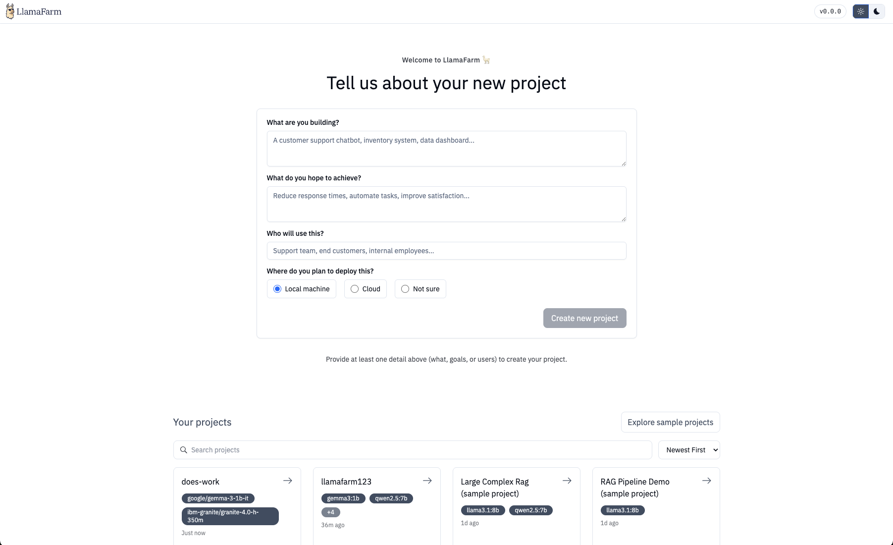

# Designer Web UI

The LlamaFarm Designer is a modern, browser-based interface for building and managing AI projects. It provides a visual way to configure projects, manage datasets, test prompts, and interact with your AI systems—all without touching the command line.

## What is the Designer?

The Designer is a React-based web application that complements the `lf` CLI. While the CLI excels at automation and scripting, the Designer offers:

- **Visual project management**: Create and configure projects through an intuitive interface
- **Interactive dataset management**: Upload files via drag-and-drop, configure processing strategies visually
- **Real-time configuration**: Edit your `llamafarm.yaml` with live validation and helpful hints
- **Integrated chat interface**: Test your AI project with full RAG context
- **Dual-mode editing**: Switch between visual designer and direct YAML editing

## When to Use the Designer vs CLI

Use the **Designer** when you want to:

- Quickly prototype and experiment with configurations
- Visualize your project structure and relationships
- Upload and manage datasets interactively
- Test prompts and see results in real-time
- Get immediate feedback on configuration errors

Use the **CLI** when you want to:

- Automate workflows and integrate with CI/CD
- Process large batches of data
- Script repetitive tasks
- Work in headless/remote environments

## Accessing the Designer

The easiest way to start the Designer is through the `lf start` command:

```bash
lf start
```

This automatically launches:

- The FastAPI server (port 14345)
- The RAG worker
- The Designer web UI (port **14345**)

Once started, open your browser to:

```
http://localhost:14345
```

The Designer is served by the same FastAPI server, so it shares port 14345 with the API.


_The Designer home page where you can create and select projects_

## Main Sections

The Designer is organized into several key sections:

### Projects

Switch between projects or create new ones. Each project has its own configuration, datasets, and chat history.

### Dashboard

Get an overview of your active project, including:

- Project configuration summary
- Dataset statistics
- Quick actions for common tasks
- Version history

### Data

Manage your datasets and processing strategies:

- Upload files via drag-and-drop or file picker
- Create and configure data processing strategies
- Monitor ingestion progress
- View dataset details and file lists

### Models

Configure runtime providers and models:

- Select from available models (Ollama, OpenAI, etc.)
- Configure model parameters (temperature, max tokens, etc.)
- Test model connections
- Download models for local use

### Databases

Set up RAG (Retrieval-Augmented Generation):

- Configure vector databases
- Choose embedding models
- Select retrieval strategies
- Test queries against your data

### Prompts

Design and test system prompts:

- Create prompt templates
- Test prompts with different inputs
- Compare outputs across models
- Save effective prompts to your configuration

### Chat

Interactive testing with your AI project:

- Chat with full project context
- Toggle RAG on/off
- View retrieved documents
- Debug responses

### Config Editor Mode

Every section includes a toggle to switch between Designer (visual) mode and Config Editor (YAML) mode. In Config Editor mode, you can:

- Directly edit the `llamafarm.yaml` file
- See real-time validation errors
- Search and navigate large configurations
- Copy/paste configuration snippets

## Next Steps

- Explore the [Features Guide](./features.md) for detailed walkthroughs of each section
- Learn about [Development Setup](./development.md) if you want to contribute or customize the Designer
- Check out the [Quickstart Guide](../quickstart/index.md) to create your first project

## Troubleshooting

**Designer won't load:**

- Ensure the server is running (`lf start` or check Docker containers)
- Verify the server is accessible at `http://localhost:14345/health/liveness`
- Check browser console for connection errors

**Can't connect to API:**

- The Designer expects the server at `localhost:14345` by default
- If using a custom setup, set the `VITE_APP_API_URL` environment variable

**Changes not saving:**

- Check for validation errors (red highlights in Config Editor)
- Ensure you have write permissions to your project directory
- Look for error messages in the top-right toast notifications
