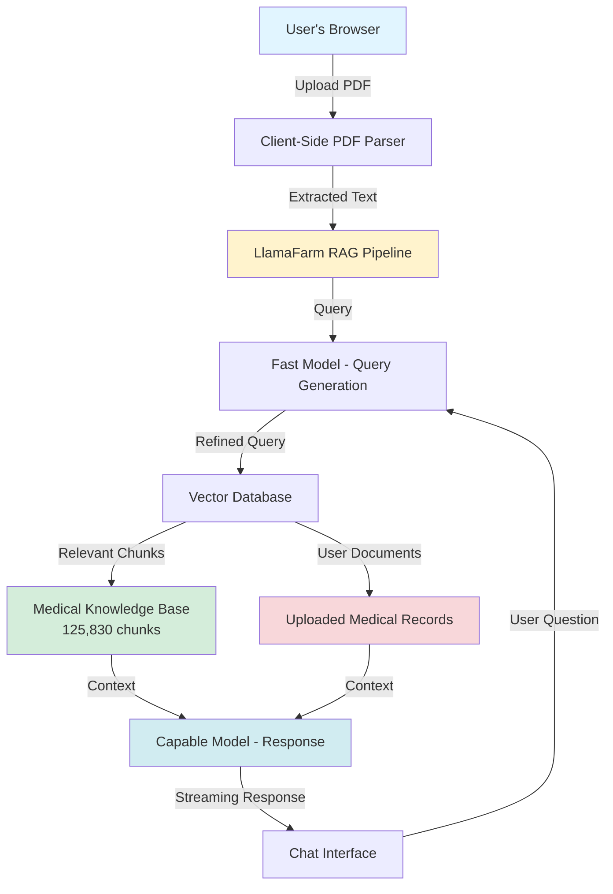

# Personal Medical Assistant 🏥

A 100% local, privacy-first medical assistant that helps you understand your medical records using AI and evidence-based medical knowledge. Built with Next.js and LlamaFarm, all PDF processing happens entirely in your browser – your health data never leaves your device.

## Video Demo

<div style={{position: 'relative', paddingBottom: '56.25%', height: 0, overflow: 'hidden', maxWidth: '100%', marginBottom: '2rem'}}>
  <iframe
    style={{position: 'absolute', top: 0, left: 0, width: '100%', height: '100%'}}
    src="https://www.youtube.com/embed/H6WKKzYPLlQ"
    title="Personal Medical Assistant Demo"
    frameBorder="0"
    allow="accelerometer; autoplay; clipboard-write; encrypted-media; gyroscope; picture-in-picture"
    allowFullScreen>
  </iframe>
</div>

Watch the full demonstration of the Medical Records Helper in action, showing how it processes medical documents locally and provides intelligent, evidence-based responses to your health questions.

## ✨ Key Features

### 🔒 Complete Privacy
- **PDFs parsed client-side** – All document processing happens in your browser
- **No server uploads** – Your files never leave your device
- **PHI protection** – Protected Health Information stays completely private
- **Local-first architecture** – Full HIPAA-aligned approach to sensitive data

### 🤖 Multi-Hop Agentic RAG
- **AI orchestration** – Intelligent query generation and refinement
- **Knowledge retrieval** – Semantic search across medical literature
- **Response synthesis** – Combines multiple sources for comprehensive answers
- **Chain-of-thought reasoning** – Transparent decision-making process

### 📚 Medical Knowledge Base
- **125,830 knowledge chunks** from authoritative medical textbooks
- **18 medical textbooks** from the [MedRAG dataset](https://github.com/Teddy-XiongGZ/MedRAG)
- **Evidence-based information** – Vetted medical knowledge sources
- **Semantic indexing** – Fast, accurate retrieval of relevant information

### ⚡ Two-Tier AI Architecture
- **Fast model** for query generation and routing (e.g., Llama 3.2 3B)
- **Capable model** for comprehensive medical responses (e.g., Qwen 2.5 14B)
- **Optimized inference** – Balance between speed and quality
- **Streaming responses** – Real-time output for better UX

### 💬 Streaming Chat Interface
- **Real-time streaming** – See responses as they're generated
- **Collapsible agent reasoning** – Inspect the AI's decision-making process
- **Conversation history** – Maintain context across multiple queries
- **Citation support** – Link responses to source documents

### 📄 Smart Document Analysis
- **Semantic chunking** – Intelligent splitting of medical documents
- **Medical context awareness** – Understands clinical terminology and structure
- **Cross-document synthesis** – Correlate information across multiple records
- **Metadata extraction** – Automatically identify key information

### ⚙️ Configurable Retrieval
- **Adjustable top-k** – Control how many documents to retrieve
- **Score thresholds** – Filter low-relevance results
- **Local document toggle** – Choose between uploaded docs or knowledge base
- **Hybrid search** – Combine keyword and semantic search

### 🎨 Modern UI
- **Built with shadcn/ui** – Beautiful, accessible components
- **Tailwind CSS** – Responsive, mobile-friendly design
- **Dark mode support** – Easy on the eyes for extended use
- **Intuitive workflow** – Upload, chat, understand

## Architecture Overview



### How It Works

1. **Document Upload** – Drop your medical PDF into the browser interface
2. **Client-Side Parsing** – PDF is parsed using PDF.js entirely in JavaScript
3. **Semantic Chunking** – Text is split into meaningful chunks with medical context
4. **Query Processing** – Your question is analyzed by a fast model to generate optimal search queries
5. **RAG Retrieval** – Relevant information is retrieved from both your documents and the medical knowledge base
6. **Response Generation** – A more capable model synthesizes the information into a comprehensive answer
7. **Stream & Display** – Response is streamed in real-time with citations and reasoning

## Use Cases

### 🩺 Understanding Test Results
Ask questions like:
- "What does my hemoglobin A1c level of 6.8% mean?"
- "Should I be concerned about elevated liver enzymes?"
- "Explain my cholesterol panel results"

### 💊 Medication Information
Get context about prescriptions:
- "What are the side effects of metformin?"
- "Why was I prescribed this medication?"
- "Are there any drug interactions I should know about?"

### 🏥 Procedure Preparation
Prepare for medical procedures:
- "What should I expect before my colonoscopy?"
- "How do I prepare for an MRI with contrast?"
- "What are the risks of this surgery?"

### 📋 Medical History Synthesis
Consolidate your records:
- "Summarize my visits from the last 6 months"
- "What were my blood pressure trends over time?"
- "List all medications I've been prescribed"

### 🔍 Second Opinion Research
Research conditions and treatments:
- "What are alternative treatments for hypertension?"
- "What does current research say about this diagnosis?"
- "Are there any clinical trials for my condition?"

## Getting Started

### Prerequisites

1. **LlamaFarm installed and running** – Follow the [Quickstart Guide](../quickstart/index.md)
2. **Two models configured**:
   - Fast model (e.g., `llama3.2:3b`) for query generation
   - Capable model (e.g., `qwen2.5:14b`) for responses
3. **Medical knowledge base** – Download and process the MedRAG dataset

### Installation

```bash
# Clone the local-ai-apps repository
git clone https://github.com/llama-farm/local-ai-apps.git
cd local-ai-apps/Medical-Records-Helper

# Install dependencies
npm install

# Configure environment variables
cp .env.example .env.local
# Edit .env.local with your LlamaFarm API endpoint

# Start the development server
npm run dev
```

### Configuration

Edit your `llamafarm.yaml` to configure the two-tier model setup:

```yaml
version: v1
name: medical-assistant
namespace: personal

runtime:
  models:
    fast-model:
      description: "Fast model for query generation"
      provider: ollama
      model: llama3.2:3b
      base_url: http://localhost:11434/v1

    capable-model:
      description: "Capable model for medical responses"
      provider: ollama
      model: qwen2.5:14b
      base_url: http://localhost:11434/v1

  default_model: capable-model

rag:
  databases:
    - name: medical_knowledge
      type: chroma
      path: ./data/medical_knowledge

  data_processing_strategies:
    - name: medical_processor
      parser: pdf
      extractors:
        - type: text
      chunker:
        type: semantic
        chunk_size: 1000
        chunk_overlap: 200
      embedder:
        model: all-MiniLM-L6-v2
```

### Setting Up the Medical Knowledge Base

```bash
# Download the MedRAG dataset
wget https://github.com/Teddy-XiongGZ/MedRAG/releases/download/v1.0/textbooks.zip
unzip textbooks.zip

# Create dataset
lf datasets create medical_texts -s medical_processor -b medical_knowledge

# Upload the textbooks
lf datasets upload medical_texts textbooks/*.pdf

# Process into vector database (this may take a while)
lf datasets process medical_texts
```

## Privacy & Security

### HIPAA Compliance Considerations

While this application is designed with privacy in mind, consider these factors:

✅ **What's Private:**
- All PDF parsing happens client-side
- Documents are not stored on any server
- Queries are processed locally via LlamaFarm
- No data is sent to external APIs

⚠️ **Important Notes:**
- LlamaFarm must be running locally (not exposed to internet)
- Ensure your machine is secured (encrypted disk, screensaver lock)
- Consider using this on a dedicated, air-gapped machine for maximum security
- Review your local network security if accessing from multiple devices

### Data Flow

```
Your Device Only:
┌─────────────────────────────────────────────────────────┐
│  Browser (PDF Parsing) ──> LlamaFarm (Local) ──> Models │
│  No Internet Required     No Server Upload    Local RAM │
└─────────────────────────────────────────────────────────┘
```

## Performance Tips

### Hardware Recommendations

**Minimum Configuration:**
- **CPU**: 4 cores (8 recommended)
- **RAM**: 16GB (32GB recommended)
- **Storage**: 50GB free space for models and knowledge base
- **GPU**: Optional, but significantly speeds up inference

**Optimal Configuration:**
- **CPU**: 8+ cores
- **RAM**: 32GB+
- **GPU**: NVIDIA GPU with 8GB+ VRAM (for faster inference)
- **Storage**: SSD recommended

### Model Selection

Choose models based on your hardware:

| Hardware | Fast Model | Capable Model |
|----------|-----------|---------------|
| CPU Only | llama3.2:1b | llama3.2:3b |
| 8GB GPU | llama3.2:3b | qwen2.5:7b |
| 16GB GPU | llama3.2:3b | qwen2.5:14b |
| 24GB+ GPU | llama3.2:3b | qwen2.5:32b |

## Technical Details

### PDF Processing Pipeline

The client-side PDF processing uses PDF.js to:
1. Extract text content page by page
2. Preserve formatting and structure
3. Identify tables and lists
4. Extract metadata (dates, patient info)

### RAG Strategy

The multi-hop agentic RAG approach:
1. **Query Analysis** – Fast model analyzes the user's question
2. **Query Generation** – Generate multiple search queries to capture different aspects
3. **Retrieval** – Semantic search across knowledge base + user documents
4. **Re-ranking** – Score and filter results by relevance
5. **Synthesis** – Capable model generates comprehensive response with citations

### Streaming Implementation

Responses stream using Server-Sent Events (SSE):
```javascript
// Client-side streaming handler
const eventSource = new EventSource('/api/chat');
eventSource.onmessage = (event) => {
  const chunk = JSON.parse(event.data);
  appendToChat(chunk.content);
};
```

## Limitations

### What This Tool Is NOT

❌ **Not a replacement for medical professionals** – Always consult qualified healthcare providers
❌ **Not for emergencies** – Call 911 or go to the ER for urgent medical issues
❌ **Not diagnostic** – Cannot diagnose conditions or prescribe treatments
❌ **Not medical advice** – For informational and educational purposes only

### Known Limitations

- **Language support** – Currently optimized for English medical documents
- **Handwritten notes** – Cannot process handwritten records (OCR not included)
- **Image analysis** – Cannot interpret medical images (X-rays, CT scans, etc.)
- **Complex tables** – May have difficulty with intricate tabular data
- **Real-time data** – Cannot access current labs or vitals from healthcare systems

## Troubleshooting

### PDFs Not Parsing

**Problem:** Uploaded PDF shows no content
**Solutions:**
- Check if PDF is encrypted (password-protected)
- Ensure PDF contains text (not scanned images without OCR)
- Try a different PDF viewer to verify file integrity
- Check browser console for JavaScript errors

### Slow Response Times

**Problem:** AI responses take too long
**Solutions:**
- Switch to smaller/faster models
- Reduce RAG top-k setting (retrieve fewer chunks)
- Increase score threshold (more selective retrieval)
- Check system resources (CPU/RAM usage)
- Consider GPU acceleration

### Poor Answer Quality

**Problem:** Responses are vague or incorrect
**Solutions:**
- Use a more capable model for response generation
- Increase top-k to retrieve more context
- Ensure medical knowledge base is properly processed
- Refine your questions to be more specific
- Check that relevant documents are uploaded

### LlamaFarm Connection Issues

**Problem:** Cannot connect to LlamaFarm API
**Solutions:**
- Verify LlamaFarm is running: `lf start`
- Check API endpoint in `.env.local`
- Ensure correct port (default: 14345)
- Check firewall settings
- Review LlamaFarm logs for errors

## Contributing

This example is part of the [local-ai-apps](https://github.com/llama-farm/local-ai-apps) repository. Contributions welcome!

### Ideas for Enhancement

- 📊 **Visualization** – Chart trends from lab results over time
- 🌍 **Multi-language** – Support for non-English medical documents
- 🔊 **Voice interface** – Ask questions using speech-to-text
- 📱 **Mobile app** – Native iOS/Android versions
- 🔗 **EHR integration** – Connect to healthcare system APIs (with proper authorization)
- 🧪 **Lab result interpretation** – Automated flagging of abnormal values
- 📅 **Appointment preparation** – Generate questions for your next doctor visit

## Resources

### Medical Knowledge Sources

- [MedRAG Dataset](https://github.com/Teddy-XiongGZ/MedRAG) – 18 authoritative medical textbooks
- [PubMed Central](https://www.ncbi.nlm.nih.gov/pmc/) – Free full-text archive of biomedical literature
- [UpToDate](https://www.uptodate.com/) – Evidence-based clinical decision support (subscription)

### Related Projects

- [LlamaFarm Documentation](https://docs.llamafarm.ai) – Full platform documentation
- [LlamaFarm GitHub](https://github.com/llama-farm/llamafarm) – Main repository
- [Local AI Apps](https://github.com/llama-farm/local-ai-apps) – Collection of privacy-first applications

### Further Reading

- [HIPAA Privacy Rule](https://www.hhs.gov/hipaa/for-professionals/privacy/index.html)
- [Patient Rights & Medical Records](https://www.hhs.gov/hipaa/for-individuals/medical-records/index.html)
- [Understanding Your Lab Results](https://medlineplus.gov/lab-tests/)

---

## Legal Disclaimer

**IMPORTANT:** This application is for educational and informational purposes only. It is not intended to be a substitute for professional medical advice, diagnosis, or treatment. Always seek the advice of your physician or other qualified health provider with any questions you may have regarding a medical condition. Never disregard professional medical advice or delay in seeking it because of something you have read through this application.

The medical knowledge base includes information from publicly available medical textbooks and is provided "as is" without warranty of any kind. The developers of this application are not liable for any damages or health issues arising from the use of this tool.

If you think you may have a medical emergency, call your doctor or 911 immediately.

---

## Next Steps

- Learn about [RAG configuration](../rag/index.md)
- Explore [multi-model setups](../models/index.md)
- Review [privacy best practices](../deployment/index.md)
- Check out [other examples](./index.md)
